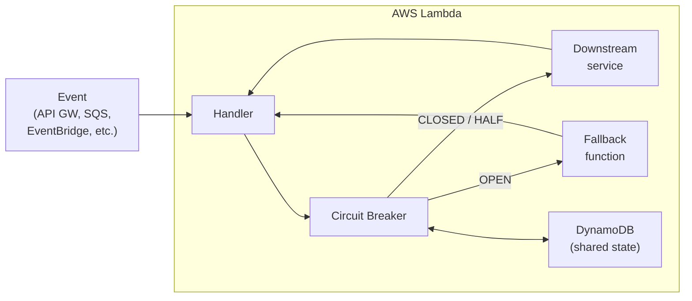

# circuitbreaker-lambda

[](https://www.npmjs.com/package/circuitbreaker-lambda)
[](LICENSE)
[](package.json)
[](https://www.typescriptlang.org/)

Circuit breaker for AWS Lambda with distributed state. Unlike in-memory circuit breakers, `circuitbreaker-lambda` shares state across Lambda invocations and concurrent instances using DynamoDB, with support for custom state backends. Designed to fail open -- if the state provider is unavailable, requests pass through rather than failing.

| Path | Runtimes | How | When to use |
| --- | --- | --- | --- |
| [npm package](#getting-started-npm-package) | Node.js 20+ | Import library or use Middy middleware | Programmatic control, Node.js only |
| [Lambda Layer](#getting-started-lambda-layer) | Any managed runtime | Add layer + env var | Any runtime, HTTP-based API |

Both paths share the same DynamoDB state schema -- functions using either approach share circuit state.



## Table of Contents

- [Getting Started: npm Package](#getting-started-npm-package)
- [Getting Started: Lambda Layer](#getting-started-lambda-layer)
- [Circuit Breaker States](#circuit-breaker-states)
- [Configuration](#configuration)
- [Environment Variables](#environment-variables)
- [Fail-Open Design](#fail-open-design)
- [Concurrent Instances and Distributed State](#concurrent-instances-and-distributed-state)
- [State Schema](#state-schema)
- [Advanced Usage](#advanced-usage)
- [Examples](#examples)
- [Acknowledgments](#acknowledgments)
- [License](#license)

## Getting Started: npm Package

### 1. Install

```bash
npm install circuitbreaker-lambda
```

**Requirements:** Node.js >= 20

### 2. Create a DynamoDB table

```bash
aws dynamodb create-table \
  --table-name circuitbreaker-table \
  --attribute-definitions AttributeName=id,AttributeType=S \
  --key-schema AttributeName=id,KeyType=HASH \
  --billing-mode PAY_PER_REQUEST
```

### 3. Set the environment variable

Add to your Lambda function:

```bash
CIRCUITBREAKER_TABLE=circuitbreaker-table
```

### 4. Add IAM permissions

Grant your Lambda execution role `GetItem` and `UpdateItem` on the table:

```json
{
  "Effect": "Allow",
  "Action": ["dynamodb:GetItem", "dynamodb:UpdateItem"],
  "Resource": "arn:aws:dynamodb:*:*:table/circuitbreaker-table"
}
```

### 5. Wrap your calls

```ts
import { CircuitBreaker } from "circuitbreaker-lambda";

const circuitBreaker = new CircuitBreaker(unreliableFunction, {
  failureThreshold: 5,
  successThreshold: 2,
  timeout: 10000,
  fallback: fallbackFunction,
});

export const handler = async () => {
  const result = await circuitBreaker.fire();
  return { statusCode: 200, body: JSON.stringify(result) };
};
```

CommonJS:

```js
const { CircuitBreaker } = require("circuitbreaker-lambda");

const circuitBreaker = new CircuitBreaker(unreliableFunction, options);
```

### Using Middy?

If you use [Middy](https://middy.js.org/) (v4+), use the middleware variant instead of wrapping your calls. The middleware protects the entire handler -- when the circuit is OPEN, the handler is skipped:

```ts
import middy from "@middy/core";
import { circuitBreakerMiddleware } from "circuitbreaker-lambda/middy";

export const handler = middy(async (event) => {
  const data = await callDownstreamService();
  return { statusCode: 200, body: JSON.stringify(data) };
}).use(
  circuitBreakerMiddleware({
    circuitId: "downstream-api",
    failureThreshold: 3,
    fallback: async () => ({ statusCode: 503, body: "Service unavailable" }),
  })
);
```

The middleware uses `before`/`after`/`onError` hooks: `before` checks the circuit and short-circuits with the fallback if OPEN, `after` records success, `onError` records failure and rethrows.

## Getting Started: Lambda Layer

The Lambda Layer enables circuit breaker protection with **any Lambda runtime** -- Node.js, Python, Java, .NET, Ruby. It runs a Rust-based extension as a local HTTP sidecar that your function calls.

### 1. Download the layer zip

Get `circuitbreaker-lambda-layer-x86_64.zip` or `circuitbreaker-lambda-layer-aarch64.zip` from the [latest GitHub release](https://github.com/gunnargrosch/circuitbreaker-lambda/releases/latest).

### 2. Publish the layer to your account

```bash
aws lambda publish-layer-version \
  --layer-name circuitbreaker-lambda \
  --zip-file fileb://circuitbreaker-lambda-layer-aarch64.zip \
  --compatible-architectures arm64 \
  --region eu-west-1
```

### 3. Add the layer and environment variable

Add the layer ARN to your function and set `CIRCUITBREAKER_TABLE`. The extension binds its HTTP server and registers with the Lambda Extensions API during INIT -- Lambda won't invoke your handler until the extension is ready.

### 4. Call the local HTTP API from your function

The extension listens on `http://127.0.0.1:4243` (configurable via `CIRCUITBREAKER_PORT`).

**Node.js:**

```js
const resp = await fetch("http://127.0.0.1:4243/circuit/my-service");
const { allowed, state } = await resp.json();
if (!allowed) return { statusCode: 503, body: "Circuit OPEN" };

try {
  const result = await callDownstream();
  await fetch("http://127.0.0.1:4243/circuit/my-service/success", { method: "POST" });
  return { statusCode: 200, body: JSON.stringify(result) };
} catch (err) {
  await fetch("http://127.0.0.1:4243/circuit/my-service/failure", { method: "POST" });
  return { statusCode: 500, body: err.message };
}
```

**Python:**

```python
import json, urllib.request

check = json.loads(urllib.request.urlopen("http://127.0.0.1:4243/circuit/my-service").read())
if not check["allowed"]:
    return {"statusCode": 503, "body": "Circuit OPEN"}

# ... call downstream, then POST /circuit/my-service/success or /failure
```

### Layer HTTP API

| Endpoint | Method | Description |
| --- | --- | --- |
| `/circuit/{id}` | GET | Check circuit state. Returns `{"allowed": true, "state": "CLOSED"}` |
| `/circuit/{id}/success` | POST | Record success. Returns `{"state": "CLOSED"}` |
| `/circuit/{id}/failure` | POST | Record failure. Returns `{"state": "OPEN"}` |
| `/health` | GET | Health check |

`{id}` must be 1-256 characters, using only alphanumeric characters, hyphens, underscores, dots, and colons (e.g., `my-service`, `payments.api`, `tenant:123`).

### Supported Runtimes

The layer works with all supported Lambda runtimes:

- **Node.js:** nodejs24.x, nodejs22.x, nodejs20.x
- **Python:** python3.14, python3.13, python3.12, python3.11, python3.10
- **Java:** java25, java21, java17, java11, java8.al2
- **.NET:** dotnet10, dotnet8
- **Ruby:** ruby3.4, ruby3.3, ruby3.2
- **Custom:** provided.al2023, provided.al2 (Go, Rust, C++, etc.)

Both x86_64 and arm64 architectures are supported.

> **Memory and cold starts:** Lambda allocates CPU proportionally to memory. At the default 128MB, cold starts are CPU-starved (AWS SDK initialization, TLS handshake, credential resolution). At 512MB, the layer adds ~350ms to cold start and warm invocations have near-zero overhead. The npm package adds ~50ms to cold start at 512MB. Both paths benefit from higher memory settings.

## Circuit Breaker States

| State | Description |
| --- | --- |
| `CLOSED` | Normal operation. All calls pass through. |
| `OPEN` | Requests fail immediately (or use fallback). Timeout uses exponential backoff. |
| `HALF` | A single probe request passes through. One failure immediately reopens. |

### State Transitions

- **CLOSED -> OPEN**: `failureCount >= failureThreshold` (within `windowDuration`)
- **OPEN -> HALF**: Timeout expires (`nextAttempt <= Date.now()`)
- **HALF -> OPEN**: Any single failure (with exponential backoff on timeout)
- **HALF -> CLOSED**: `successCount >= successThreshold`

## Configuration

Both the npm package and Lambda Layer support the same circuit breaker settings. The npm package uses constructor options; the layer uses environment variables.

| Setting | npm option | Layer env var | Default | Description |
| --- | --- | --- | --- | --- |
| Failure threshold | `failureThreshold` | `CIRCUITBREAKER_FAILURE_THRESHOLD` | `5` | Failed attempts before circuit opens |
| Success threshold | `successThreshold` | `CIRCUITBREAKER_SUCCESS_THRESHOLD` | `2` | Successful attempts in HALF before closing |
| Timeout | `timeout` | `CIRCUITBREAKER_TIMEOUT_MS` | `10000` | Initial OPEN duration in ms |
| Max timeout | `maxTimeout` | `CIRCUITBREAKER_MAX_TIMEOUT_MS` | `60000` | Max exponential backoff cap in ms |
| Window duration | `windowDuration` | `CIRCUITBREAKER_WINDOW_DURATION_MS` | `60000` | Failure count reset window in ms |

### npm-Only Options

| Option | Type | Default | Description |
| --- | --- | --- | --- |
| `fallback` | `function \| null` | `null` | Async fallback function for graceful degradation |
| `stateProvider` | `StateProvider` | `DynamoDBProvider` | Custom state backend |
| `circuitId` | `string` | `AWS_LAMBDA_FUNCTION_NAME` | Unique identifier for this circuit (required) |
| `cacheTtlMs` | `number` | `0` | Warm invocation cache TTL in ms (0 = disabled) |
| `tableName` | `string` | `CIRCUITBREAKER_TABLE` | DynamoDB table name (only with default provider) |

### Layer-Only Options

| Variable | Default | Description |
| --- | --- | --- |
| `CIRCUITBREAKER_PORT` | `4243` | HTTP server port |

## Environment Variables

| Variable | Used by | Description |
| --- | --- | --- |
| `CIRCUITBREAKER_TABLE` | Both | DynamoDB table name |
| `CIRCUITBREAKER_PORT` | Layer | HTTP server port (default: `4243`) |
| `CIRCUITBREAKER_FAILURE_THRESHOLD` | Layer | Failures before circuit opens (default: `5`) |
| `CIRCUITBREAKER_SUCCESS_THRESHOLD` | Layer | Successes in HALF before closing (default: `2`) |
| `CIRCUITBREAKER_TIMEOUT_MS` | Layer | Initial OPEN timeout in ms (default: `10000`) |
| `CIRCUITBREAKER_MAX_TIMEOUT_MS` | Layer | Max exponential backoff cap (default: `60000`) |
| `CIRCUITBREAKER_WINDOW_DURATION_MS` | Layer | Failure count reset window (default: `60000`) |

## Fail-Open Design

The circuit breaker is designed to never make things worse. If the state provider (DynamoDB or custom) is unavailable:

- **Read failures:** The circuit assumes CLOSED and lets the request through.
- **Write failures:** The response is returned normally; state loss is logged but does not affect the caller.

All provider errors are logged as structured JSON warnings:

```json
{"source":"circuitbreaker-lambda","level":"warn","action":"getState","error":"Error: connection timeout"}
```

## Concurrent Instances and Distributed State

Circuit breaker state in DynamoDB uses unconditional writes (last writer wins). This means concurrent Lambda instances can race when updating state:

- **HALF state probe races:** If two instances both read HALF state and succeed, each increments `successCount` against its own in-memory copy. The second write overwrites the first, potentially delaying the CLOSED transition.
- **Failure count races:** Two instances both reading `failureCount: 4` and failing will both write `failureCount: 5` and open the circuit. This is safe (idempotent).

In practice, these races are benign -- the circuit may be slightly slower to close than expected, but it will never miss an open. For stricter guarantees, implement a custom `StateProvider` with DynamoDB conditional writes or transactions.

## State Schema

State records use the following schema, shared between the npm package and the Lambda Layer extension:

| Field | Type | Description |
| --- | --- | --- |
| `id` | `string` | Partition key (circuit identifier) |
| `circuitState` | `string` | `CLOSED`, `OPEN`, or `HALF` |
| `failureCount` | `number` | Current failure count |
| `successCount` | `number` | Current success count (in HALF state) |
| `nextAttempt` | `number` | Epoch ms when OPEN circuit transitions to HALF |
| `lastFailureTime` | `number` | Epoch ms of last failure (for window-based reset) |
| `consecutiveOpens` | `number` | Consecutive HALF->OPEN transitions (for exponential backoff) |
| `stateTimestamp` | `number` | Epoch ms of last state write |
| `schemaVersion` | `number` | Schema version (currently `1`) |

## Advanced Usage

### Custom State Provider

The default `DynamoDBProvider` works for most cases. For testing or custom backends, implement the `StateProvider` interface:

```ts
import { CircuitBreaker, MemoryProvider } from "circuitbreaker-lambda";

// For testing (no DynamoDB needed)
const breaker = new CircuitBreaker(myFunction, {
  stateProvider: new MemoryProvider(),
  circuitId: "my-circuit",
});
```

Bring your own backend (Redis, MemoryDB, etc.):

```ts
import { CircuitBreaker } from "circuitbreaker-lambda";
import type { StateProvider, CircuitBreakerState } from "circuitbreaker-lambda";

class RedisProvider implements StateProvider {
  async getState(circuitId: string): Promise<CircuitBreakerState | undefined> { /* ... */ }
  async saveState(circuitId: string, state: CircuitBreakerState): Promise<void> { /* ... */ }
}

const breaker = new CircuitBreaker(myFunction, {
  stateProvider: new RedisProvider(),
  circuitId: "my-circuit",
});
```

### Low-Level API

For custom integration patterns (middleware, decorators, etc.), use `check()`, `recordSuccess()`, and `recordFailure()` instead of `fire()`. Pass `null` as the request function:

```ts
const breaker = new CircuitBreaker(null, { circuitId: "my-api", stateProvider: provider });

const allowed = await breaker.check();
if (!allowed) {
  return fallbackResponse;
}
try {
  const result = await callDownstream();
  await breaker.recordSuccess();
  return result;
} catch (err) {
  await breaker.recordFailure();
  throw err;
}
```

`recordSuccess()` and `recordFailure()` must be called after `check()` in the same invocation -- they operate on the state loaded by `check()`.

### Warm Invocation Caching

Opt-in caching reduces DynamoDB reads on warm Lambda invocations by serving state from an instance-level cache within the TTL window:

```ts
const breaker = new CircuitBreaker(myFunction, {
  cacheTtlMs: 200, // serve cached state for 200ms before re-fetching
});
```

> **Note:** Caching trades consistency for latency. Concurrent Lambda instances may serve stale state for up to `cacheTtlMs`. In the worst case, stale cached state can suppress the CLOSED->OPEN transition if multiple instances read cached `failureCount` and write back independently. Default is `0` (disabled). Only enable caching if you've measured the DynamoDB overhead and need to reduce it.

## Examples

Both the npm package and Lambda Layer include examples with a toggleable downstream service that lets you walk through the full circuit breaker lifecycle.

### npm Package Example

```bash
cd examples/sam
npm install
sam build
sam deploy --guided
```

| Endpoint | Description |
| --- | --- |
| `GET /` | Call downstream through the circuit breaker |
| `GET /status` | Show current circuit state and downstream health |
| `POST /toggle` | Flip downstream between healthy and unhealthy |

**Walkthrough:**

```bash
# 1. Requests succeed (circuit CLOSED)
curl $API_URL/

# 2. Make downstream unhealthy
curl -X POST $API_URL/toggle

# 3. Repeat — watch failures accumulate, then circuit opens with fallback
curl $API_URL/
curl $API_URL/
curl $API_URL/

# 4. Check circuit state
curl $API_URL/status

# 5. Make downstream healthy again
curl -X POST $API_URL/toggle

# 6. Wait 15 seconds for the timeout, then call again
#    Circuit transitions HALF -> CLOSED as requests succeed
curl $API_URL/
curl $API_URL/
```

### Lambda Layer Example

```bash
cd examples/layer
sam build
sam deploy --guided
```

To build the layer from source instead of downloading, see `layer/build.sh`.

Same workflow as above, with Node.js endpoints at `/node`, `/node/status`, `/node/toggle` and Python at `/python`, `/python/status`, `/python/toggle`.

## Acknowledgments

Inspired by Michael Nygard's book [Release It!](https://www.amazon.com/gp/product/0978739213), Martin Fowler's article on the [circuit breaker](https://martinfowler.com/bliki/CircuitBreaker.html), and Mark Michon's post on [building a Node.js circuit breaker](https://blog.bearer.sh/build-a-circuit-breaker-in-node-js/).

## Changelog

See [CHANGELOG.md](CHANGELOG.md) for a detailed list of changes.

## License

[MIT](LICENSE)
